# Video Insight Engine (VIE)

Turns any YouTube URL into an interactive app built from the video's own content — a cooking video becomes a timed recipe player; a coding tutorial becomes a code explorer with a quiz.

A video is a poor format for using what it teaches: you cannot search it, check items off, copy the code, or find one step without scrubbing. VIE extracts the content into components that fit it, such as checklists, step flows, code blocks and quizzes, and links them back to the moments in the video they came from.

[](https://github.com/kfiravra/video-insight-engine/actions/workflows/ci.yml)

<!-- LIVE-DEMO PLACEHOLDER — after demo mode is deployed, replace this comment with:
**Live demo:** https://vie.ad — one click, no sign-up.
-->

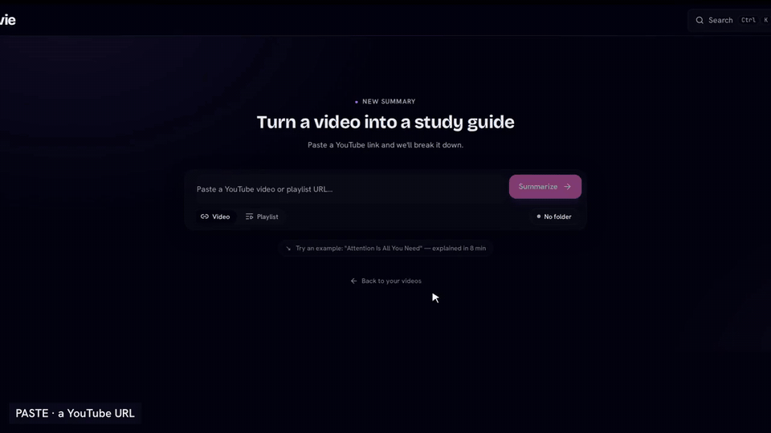

*Recorded from the running app: a real generation, Cooking Mode, the coding app's quiz, and the assistant filing the library. The processing wait is a labelled time-lapse.*

[Full walkthrough video (95 s): generate, cooking and coding apps, five more domains, moments, chat, library, search](docs/images/walkthrough.mp4)

## Screenshots

<p>
  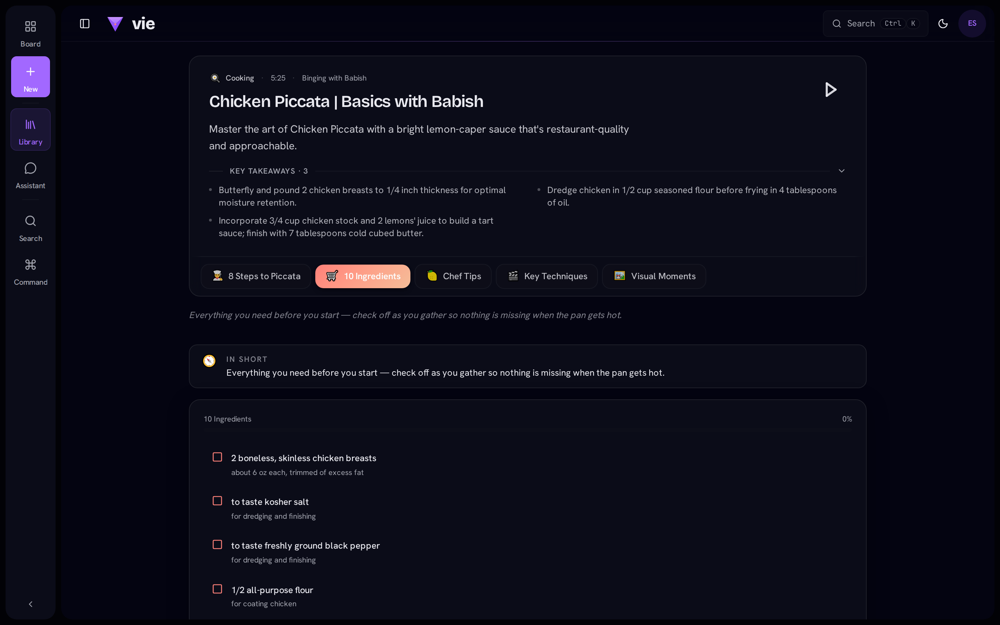
  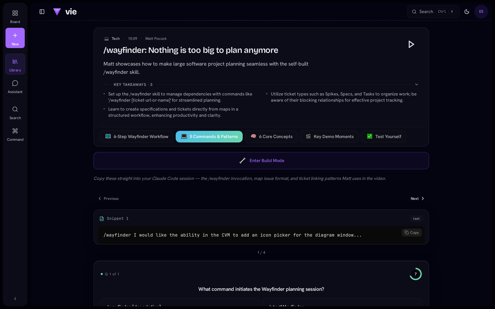
</p>

*Same pipeline, two videos. The cooking video gets an ingredient checklist and a recipe step flow; the coding tutorial gets copyable code snippets and a quiz. Classification decides which components are generated.*

<p>
  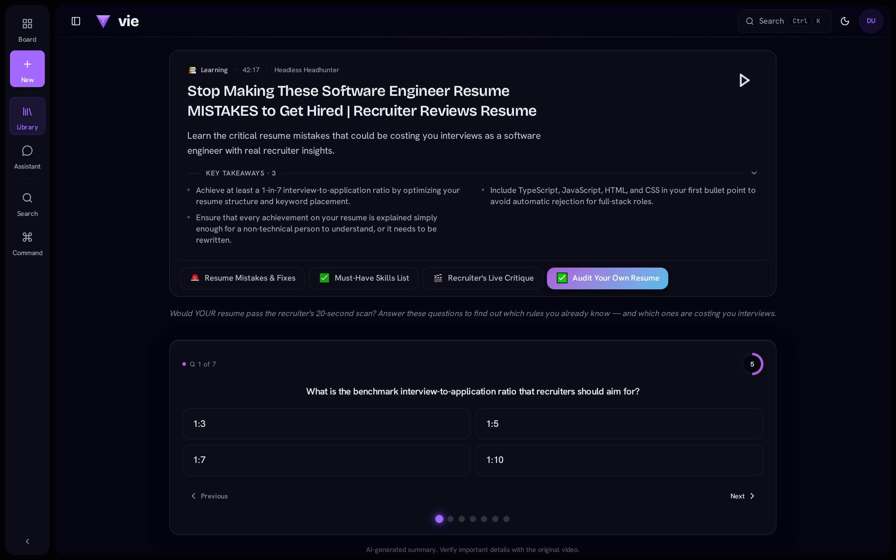
  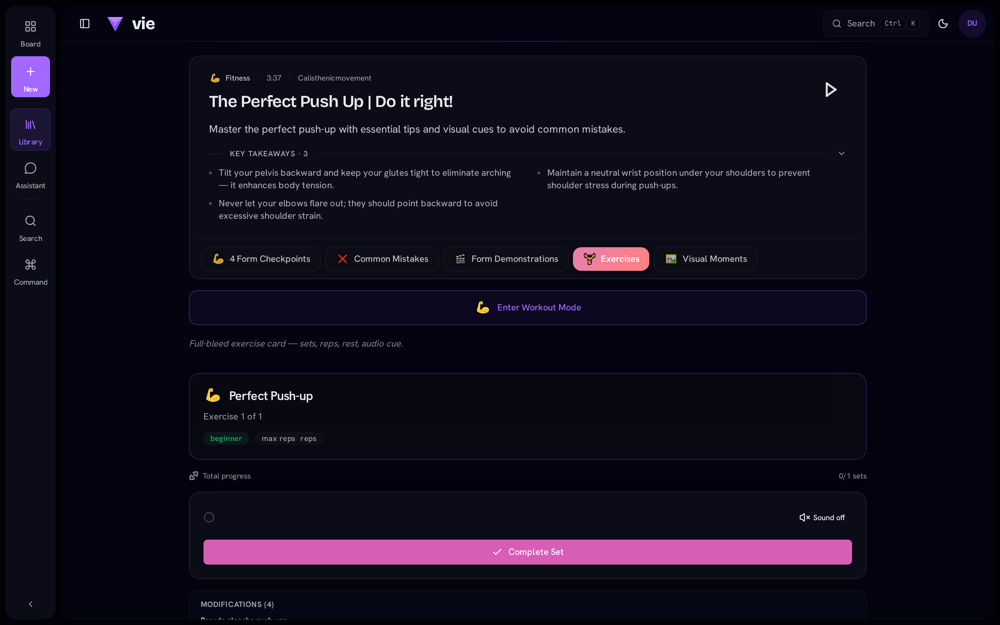
  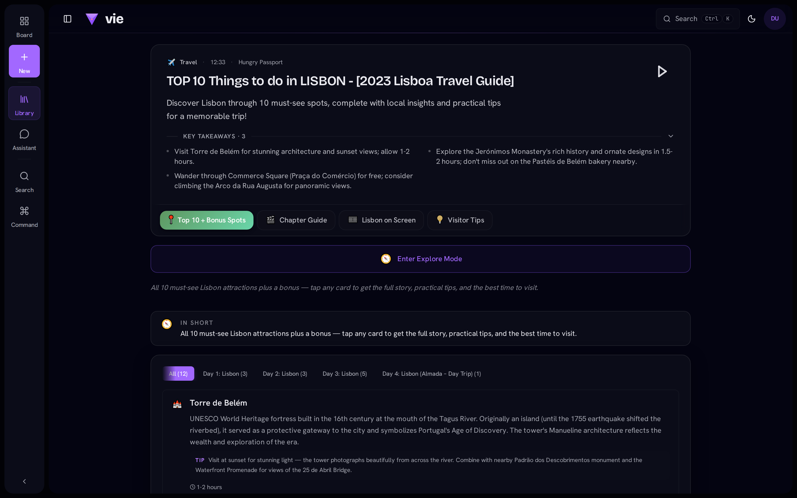
  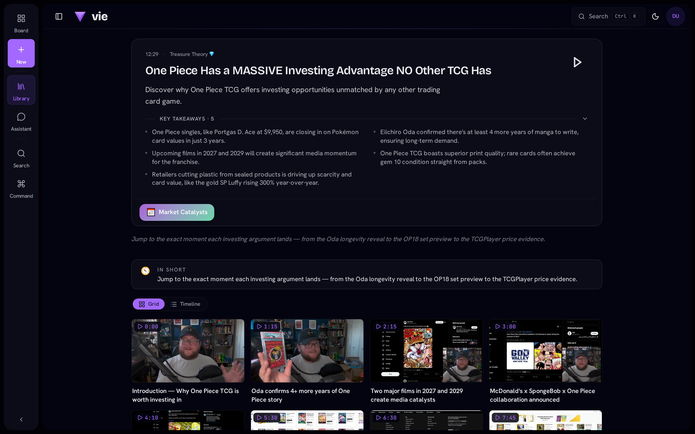
  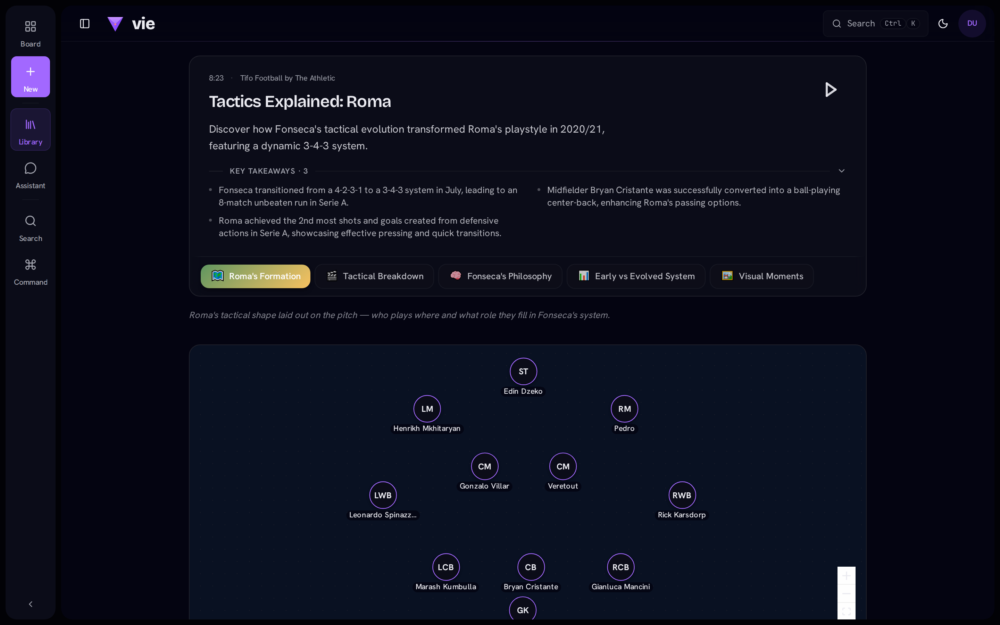
</p>

*Same pipeline; the planner picks from 29 registered components by domain.*

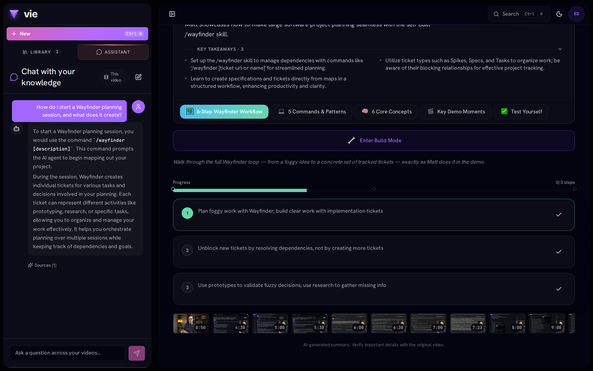

*Chat over the video's indexed content, scoped to the open video or the whole library.*

## What you get

Each video gets its own set of tabs, chosen by the planner from 29 registered components. These are the tabs generated for the two videos above.

A cooking video (Chicken Piccata, 5 minutes):

| Tab | Component | What it does |
| --- | --- | --- |
| 10 Ingredients | `checklist` | Checkable ingredient list with quantities and prep notes |
| 8 Steps to Piccata | `step_flow_canvas` | The recipe laid out as a step-by-step flow |
| Key Techniques | `moment_track` | Gallery of key moments; Jump seeks the video to each one |
| Visual Moments | `video_filmstrip` | Frame scrubber across the whole video |

A coding tutorial (a 15-minute tooling walkthrough):

| Tab | Component | What it does |
| --- | --- | --- |
| 6-Step Wayfinder Workflow | `step_player` | The workflow as steps you play through and mark done |
| 5 Commands & Patterns | `code_playground` | Code snippets with copy |
| 6 Core Concepts | `concept_canvas` | Concepts and how they connect |
| Test Yourself | `quiz_arena` | Timed quiz on the content |

Across domains, from the videos in the screenshots above:

| Domain | The video becomes | Components |
| --- | --- | --- |
| Cooking (a rice recipe) | Ingredient checklist and a step player with Cooking Mode | `checklist`, `step_player`, `spot_explorer`, `moment_track` |
| Tech (a tooling walkthrough) | Copyable commands, a concept map, a setup workflow, a quiz | `code_playground`, `concept_canvas`, `step_player`, `quiz_arena` |
| Learning (a resume review) | Mistakes and fixes, a skills list, a self-audit quiz | `spot_explorer`, `moment_track`, `quiz_arena` |
| Fitness (push-up form) | Form checkpoints, common mistakes, an exercise card with sets and reps | `step_player`, `info_grid`, `workout_room`, `moment_track` |
| Travel (a Lisbon guide) | Spots grouped by day with Explore Mode, a chapter guide, visitor tips | `spot_explorer`, `moment_track`, `video_filmstrip`, `checklist` |
| Gaming (a trading-card market video) | Key moments with frames | `moment_track`, `video_filmstrip` |
| Sport (a tactics explainer) | A formation diagram, a tactical breakdown, an early-vs-evolved radar | `formation_diagram`, `moment_track`, `spot_explorer`, `comparison_radar` |

## How it works

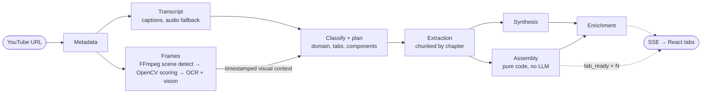

- **Classify + plan.** A fast classifier and one planning call decide the video's domain (14 domains, e.g. food, tech, travel) and design its tabs from 29 registered components. The plan determines what extraction looks for.
- **Chunked extraction.** Long videos are split by chapter (creator chapters, then detected chapters, then time splits) and batched into calls up to the context limit, so a multi-hour video takes a handful of calls.
- **Assembly.** Deterministic code turns extraction output into validated component props. The frontend renders each tab with one registry lookup.
- **Frames.** FFmpeg scene detection yields about 200 candidates. OpenCV scores them locally on six signals, and only the roughly 25 winners are re-extracted at 720p and sent to OCR and vision.
- **Streaming.** Each assembled tab is sent as an SSE event with its position, so tabs appear in place while the rest of the pipeline runs.

Stage-by-stage detail: [docs/summarizer-workflow.md](./docs/summarizer-workflow.md).

## Architecture

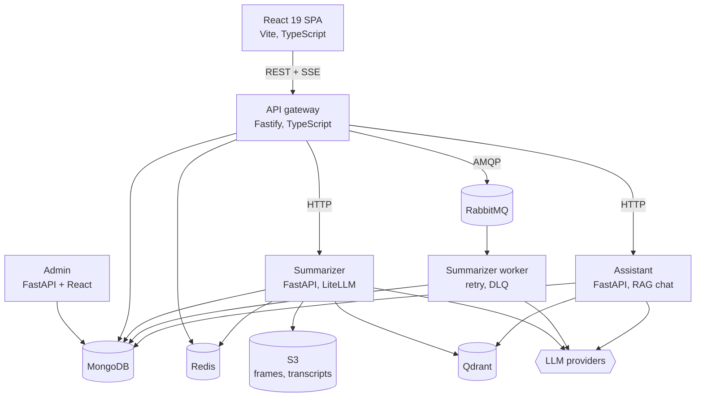

The gateway owns auth, rate limits and idempotency. The Python services own every LLM call. Full data flows and the service contract table: [docs/ARCHITECTURE.md](./docs/ARCHITECTURE.md).

## Engineering highlights

### Cost

About $0.29 for a ~20-minute video with captions (measured, v8 ledger); the Whisper fallback adds roughly $0.14 when captions are unavailable.

Models are chosen per stage through LiteLLM (`LLM_<STAGE>_MODEL`): a stronger model plans, fast models classify, synthesize and enrich. Work that does not need a model does not get one: frame scoring is local OpenCV, assembly is pure code, and prompt caching covers the plan and extraction prompts. Every call is written to an `llm_usage` ledger with its stage, model, tokens and cost. See [docs/llm-cost-model.md](./docs/llm-cost-model.md).

### Caching and idempotency

Summaries are stored under a content-addressed key that includes the pipeline version, so the same video submitted by another user is served from cache with no LLM calls. Bumping one shared version file invalidates the API's idempotency keys, the dedup key and the Redis response cache together. A Redis dispatch guard stops concurrent submissions from starting the pipeline twice. See [docs/IDEMPOTENCY.md](./docs/IDEMPOTENCY.md).

### RAG chat

The assistant retrieves from Qdrant over chunks built per component, scoped to one video or the whole library. It runs a tool-calling loop on LiteLLM: tools generate a new video app, organize the library into folders, and move videos. See [docs/RAG.md](./docs/RAG.md).

### Evaluation and observability

A retrieval gate in CI runs a golden query set against a real Qdrant and fails below recall@3 0.85 or MRR 0.7. A 20-video golden dataset runs through the live pipeline weekly and publishes to Langfuse; pull requests run the same harness as a zero-spend dry run. A sampled LLM judge scores faithfulness; it is informational, not a gate. Each pipeline run is one Langfuse trace, a request id follows a request across services, and Sentry is wired into the API, the web app and the Python services. See [docs/OBSERVABILITY.md](./docs/OBSERVABILITY.md).

### CI and deploy

The main CI workflow runs 11 parallel jobs on GitHub Actions: TypeScript typecheck and lint, design guards, ruff, seven test suites (with pyright on the Python services), and a Docker Compose image build that also validates the production config. Separate workflows on pull requests run a Playwright smoke suite against the Compose stack and the eval gates above.

Deploy is CI-gated: after a green CI run on `main`, a workflow deploys to a single EC2 host. It assumes an AWS role over OIDC, so no long-lived AWS keys are stored, and opens SSH ingress for the runner only for the duration of the deploy. See [docs/DEPLOY.md](./docs/DEPLOY.md).

## Run locally

Requires Docker and one LLM API key.

```bash
git clone https://github.com/kfiravra/video-insight-engine.git
cd video-insight-engine

cp .env.example .env        # set ANTHROPIC_API_KEY (or OPENAI_API_KEY / GEMINI_API_KEY)
docker compose up -d

curl http://localhost:3000/health    # API gateway
curl http://localhost:8000/health    # summarizer
open http://localhost:5173
```

`.env.example` documents every variable. Compose services, ports, backups and environment detail: [docs/INFRASTRUCTURE.md](./docs/INFRASTRUCTURE.md).

## Documentation

| Topic | Doc |
| --- | --- |
| System architecture and data flows | [docs/ARCHITECTURE.md](./docs/ARCHITECTURE.md) |
| Pipeline walkthrough | [docs/summarizer-workflow.md](./docs/summarizer-workflow.md) |
| API contracts | [docs/API-REFERENCE.md](./docs/API-REFERENCE.md) |
| Data models | [docs/DATA-MODELS.md](./docs/DATA-MODELS.md) |
| Security | [docs/SECURITY.md](./docs/SECURITY.md) |
| Error handling, retry, DLQ | [docs/ERROR-HANDLING.md](./docs/ERROR-HANDLING.md) |
| Frontend patterns | [docs/FRONTEND.md](./docs/FRONTEND.md) |
| GDPR deletion | [docs/GDPR.md](./docs/GDPR.md) |

## Built with Claude Code

The repo carries its Claude Code harness in [`.claude/`](./.claude): rule-based skill activation (keyword, intent and path triggers load the matching skill before an edit), six task-specific subagents, MCP integrations, and hooks that guard destructive git commands and warn on source edits without a test change.

## License

[MIT](./LICENSE)
